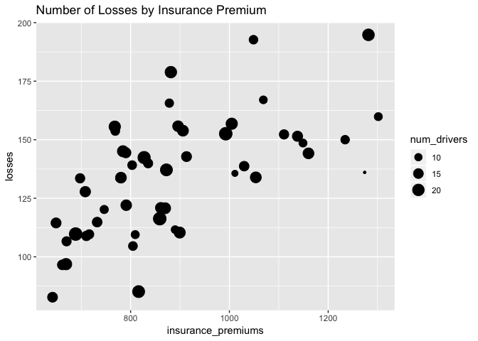
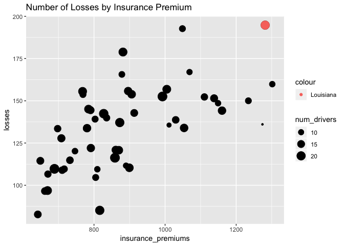
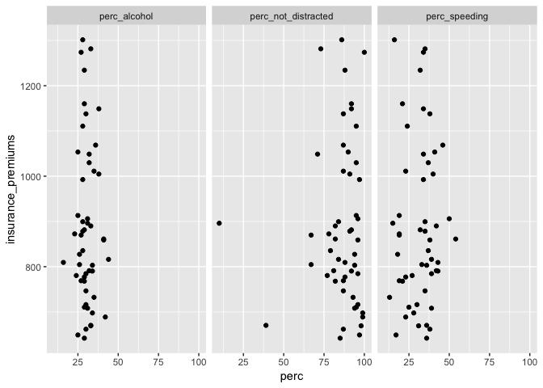

Assignment 3
================

For this assignment we are using a dataset from the website [Fivethirtyeight](http://fivethirtyeight.com/). All these datasets are available on their [GitHub page](https://github.com/fivethirtyeight/data/) and in the `fivethirtyeight` package.

1.  Install and load the `fivethirtyeight` library. For this assigment we are using the dataset `bad_drivers`.

2.  In the narrative, add a brief description (`?bad_drivers` for a description of the dataset) using *inline code* to show the variable names.

The bad\_drivers data set in the fivethirtyeight library contains 8 variables:

    1. state - The name of the state.

    2. num_drivers - The number of billions of drivers invloved in fatal collisions.

    3. perc_speeding - The percentage of drivers involved in fatal collisions who were speeding.

    4. perc_alcohol - The percentage of drivers involved in fatal collisions who drank alcohol.

    5. perc_not_distracted - The percentage of drivers involved in fatal collisions who were not distracted.

    6. perc_no_previous - The percentage of drivers involved in fatal collisions who had no prior accidents.

    7. insurance_premiums - Car insurance premiums.

    8. losses - Losses incurred by insurance companies for collisions per insured driver.

1.  Plot a dot chart of premiums by losses. Map the count of drivers to the size of the dots.

<!-- -->

    ## ── Attaching packages ──────────────────────────── tidyverse 1.2.1 ──

    ## ✔ ggplot2 3.0.0     ✔ purrr   0.2.5
    ## ✔ tibble  1.4.2     ✔ dplyr   0.7.6
    ## ✔ tidyr   0.8.1     ✔ stringr 1.3.1
    ## ✔ readr   1.1.1     ✔ forcats 0.3.0

    ## ── Conflicts ─────────────────────────────── tidyverse_conflicts() ──
    ## ✖ dplyr::filter() masks stats::filter()
    ## ✖ dplyr::lag()    masks stats::lag()



1.  Test what values from `state` are equal to "Louisiana" and assign the output to a new variable called \`Louisiana' (logical)

``` r
Louisiana <- fivethirtyeight::bad_drivers %>%
  filter(state == 'Louisiana')
```

1.  Map the variable "Louisiana" to `color`. That way, the dot referring to Louisiana should have a different color. 
2.  In your narrative, use inline code to report the average insurance premium and count of losses in US, and the premium and losses in Louisiana. Do not type those values manually, but extract them from the dataset using inline code.

The average insurance premium is 886.9576471 and the number of losses in the US is 6859.15. The state of Louisiana has a premium of 1281.55 and 194.78 losses.

1.  Report in a tabular format the 5 states with the highest premiums (include only state and insurance\_premiums)

``` r
fivethirtyeight::bad_drivers %>%
  arrange(insurance_premiums) %>%
  filter(between(row_number(),1,5))
```

    ## # A tibble: 5 x 8
    ##   state num_drivers perc_speeding perc_alcohol perc_not_distra…
    ##   <chr>       <dbl>         <int>        <int>            <int>
    ## 1 Idaho        15.3            36           29               85
    ## 2 Iowa         15.7            17           25               97
    ## 3 Maine        15.1            38           30               87
    ## 4 Sout…        19.4            31           33               98
    ## 5 Wisc…        13.8            36           33               39
    ## # ... with 3 more variables: perc_no_previous <int>,
    ## #   insurance_premiums <dbl>, losses <dbl>

1.  Reshape the dataset gathering together perc\_speeding, perc\_alcohol, perc\_not\_distracted in one variable, paired with their pecentages. Name this variable "ViolationType" and the variable for the value pairs "perc".

``` r
#fivethirtyeight::bad_drivers %>%
#  select(perc_speeding,perc_alcohol,perc_not_distracted) %>%
#  mutate(ViolationType = .)
percents <- gather(bad_drivers, key = 'ViolationType', value = 'perc', perc_alcohol, perc_speeding, perc_not_distracted)
percents
```

    ## # A tibble: 153 x 7
    ##    state num_drivers perc_no_previous insurance_premi… losses ViolationType
    ##    <chr>       <dbl>            <int>            <dbl>  <dbl> <chr>        
    ##  1 Alab…        18.8               80             785.   145. perc_alcohol 
    ##  2 Alas…        18.1               94            1053.   134. perc_alcohol 
    ##  3 Ariz…        18.6               96             899.   110. perc_alcohol 
    ##  4 Arka…        22.4               95             827.   142. perc_alcohol 
    ##  5 Cali…        12                 89             878.   166. perc_alcohol 
    ##  6 Colo…        13.6               95             836.   140. perc_alcohol 
    ##  7 Conn…        10.8               82            1069.   167. perc_alcohol 
    ##  8 Dela…        16.2               99            1138.   151. perc_alcohol 
    ##  9 Dist…         5.9              100            1274.   136. perc_alcohol 
    ## 10 Flor…        17.9               94            1160.   144. perc_alcohol 
    ## # ... with 143 more rows, and 1 more variable: perc <int>

1.  Use facetting (DO NOT use 3 distinct calls to `ggplot()`) to plot 3 dot plots for the correlation between:

-   insurance\_premiums and perc\_alcohol
-   insurance\_premiums and perc\_speeding
-   insurance\_premiums and perc\_not\_distracted

``` r
percents %>%
 ggplot() +
  geom_point(aes(x= perc, y = insurance_premiums)) +
    facet_wrap(~ViolationType)
```



1.  Mute the code for both charts and add a title to both. Knit to html.
