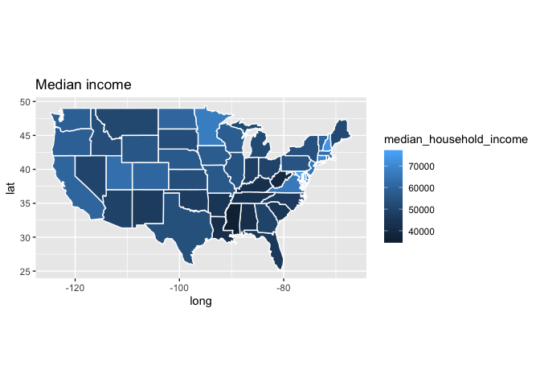
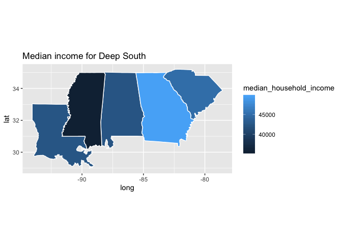

Assignment 5
================

Trump's Tweets
==============

Read the below dataset on from <https://github.com/fivethirtyeight/data/tree/master/trump-twitter>. Then use the appropriate function from the package `lubridate` to convert `created_at` into a date.

Use `geom_histogram` to plot a histogram of tweets count. Change the x-axis title into 'date' and the x-axis labels into a `mon 'yy` format (e.g., `Dec '15`).

Note that there is a difference between time and datetime: If you coerce `created_at` to a datetime (which keeps information about the time too), you will need `scale_x_datetime` instead of `scale_x_date`

``` r
dt <- read_csv('https://raw.githubusercontent.com/fivethirtyeight/data/master/trump-twitter/realDonaldTrump_poll_tweets.csv') %>%
  mutate(created_at = mdy_hms(created_at)) %>%
  ggplot() + geom_histogram(aes())
```

Income map
==========

Use the below dataset to plot a choropleth map of incomes by state. Map `median_household_income` to the state fill. For a shapefile of the US states use `map_data("state")`. Adjust the legend setting the title to "Median income" and formatting the scale as `$xx,xxx`.

``` r
dt <- read_csv('https://raw.githubusercontent.com/fivethirtyeight/data/master/hate-crimes/hate_crimes.csv')
states <- map_data("state")
dt <- mutate(dt,state = tolower(state))
MHI<- select(dt, state,median_household_income )
states<- right_join(states, MHI, by= c( 'region'='state'))
ggplot(data = states) + geom_polygon(aes(x = long, y = lat, group = group, fill = median_household_income ), color = "white") + coord_fixed(1.3)+ labs(title = 'Median income')
```



Repeat the above for the Deep South only (Louisiana, Alabama, Mississippi, Georgia, South Carolina). Add a title.

``` r
dt <- read_csv('https://raw.githubusercontent.com/fivethirtyeight/data/master/hate-crimes/hate_crimes.csv')
dt <- dt %>% 
  filter(state == "Louisiana" | state == "Alabama" | state ==  "Mississippi" | state ==  "Georgia" |state ==  "South Carolina")
states <- map_data("state")
dt <- mutate(dt,state = tolower(state))
MHI<- select(dt, state,median_household_income )
states<- right_join(states, MHI, by= c( 'region'='state'))
ggplot(data = states) + geom_polygon(aes(x = long, y = lat, group = group, fill = median_household_income ), color = "white") + coord_fixed(1.3)+ labs(title = 'Median income for Deep South')
```



Use inline code to output the median income (appropriately formatted) and the Gini-Index for Louisiana.

``` r
dt <- read_csv('https://raw.githubusercontent.com/fivethirtyeight/data/master/hate-crimes/hate_crimes.csv')
dt <- filter(dt, state == "Louisiana")
```

The median income is 42406 and the Gini-Index for Louisiana is 0.475.
