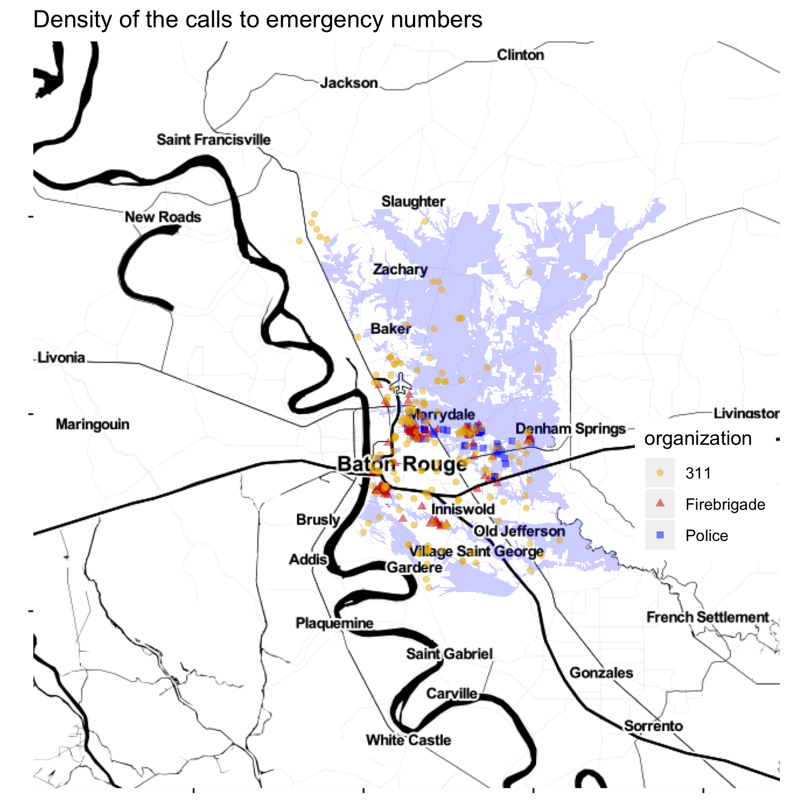

# Assignment 5

Produce a map of the locations for the emergency calls during the Lousiana Flood, 2016 in the East Baton Rouge area. The output should look similar to the below: 

Feel free to choose the style of the map (e.g., satellite, watercolor), the color-pallette, and other aesthetical attributes, but your map should at least show:

- the locations for calls to 311 calls for "DRAINAGE, EROSION, FLOODING OR HOLES"
- the locations for calls to firebrigade for "SEVERE WEATHER OR NATURAL DISASTER, OTHER" or "WATER EVACUATION"  
- the locations for calls to 911 for "LOOTING"

As a timespan, use calls between '2016-08-12' and '2016-08-22'.

Refer to the notes from `lesson11_openData/BRflood2016.R` for how to use the Socrata API to extract the emergency calls data from [BR OpenData](https://data.brla.gov/).

source(here('lectures/lesson11_openData/tokenSocrata.R'))
library(RSocrata)
library(here)
library(tidyverse)
library(ggmap)
apiEndpoint <- 'https://data.brla.gov/resource/uqxt-dtpe.csv?'
apiEndpoint2 <- 'https://data.brla.gov/resource/4w4d-4es6.csv?'
apiEndpoint3 <- 'https://data.brla.gov/resource/5rji-ddnu.csv?'
query <- "$where=createdate between '2016-08-12' and '2016-08-22'"
dt_311 <- read.socrata(paste0(apiEndpoint, query), app_token = token[['app']])
dt_311 <- as_tibble(dt_311)
dt_311 <- dt_311 %>% 
  mutate(geolocation = str_extract_all(geolocation, '[-,.,0-9]+')) %>% 
  mutate(long = map_chr(geolocation, 1), lat = map_chr(geolocation, 2)) %>% 
  mutate_at(vars(long, lat), as.double)
query <- "$where=disp_date between '2016-08-12' and '2016-08-22'"
dt_fire <- read.socrata(paste0(apiEndpoint2, query), app_token = token[['app']])
dt_fire <- as_tibble(dt_fire)
dt_fire <- dt_fire %>% 
  mutate(geolocation = str_extract_all(geolocation, '[-,.,0-9]+')) %>% 
  mutate(long = map_chr(geolocation, 1), lat = map_chr(geolocation, 2)) %>% 
  mutate_at(vars(long, lat), as.double)
query <- "$where=offense_date between '2016-08-12' and '2016-08-22'"
dt_911 <- read.socrata(paste0(apiEndpoint3, query), app_token = token[['app']])
dt_911 <- as_tibble(dt_911)
dt_911 <- dt_911 %>% 
  mutate(geolocation = str_extract_all(geolocation, '[-,.,0-9]+')) %>% 
  mutate(long = map_chr(geolocation, 1), lat = map_chr(geolocation, 2)) %>% 
  mutate_at(vars(long, lat), as.double)
#ggmap::register_google(key = googleAPIkey)
brMap <- readRDS(here::here('data/mapTerrainBR.RDS'))
ggmap::ggmap(brMap) +
  geom_point(data = filter(dt_311, parenttype == "DRAINAGE, EROSION, FLOODING OR HOLES"), aes(x = long, y = lat), color = 'darkred', alpha = .33) + geom_point(data = filter(dt_fire, parenttype == "SEVERE WEATHER OR NATURAL DISASTER, OTHER, OR WATER EVACUATION"), aes(x = long, y = lat), color = 'blue', alpha = .33) + geom_point(data = filter(dt_911, parenttype == "LOOTING"), aes(x = long, y = lat), color = 'green', alpha = .33) + ggtitle('Position of calls to 311, Fire Brigade, and 911')
  