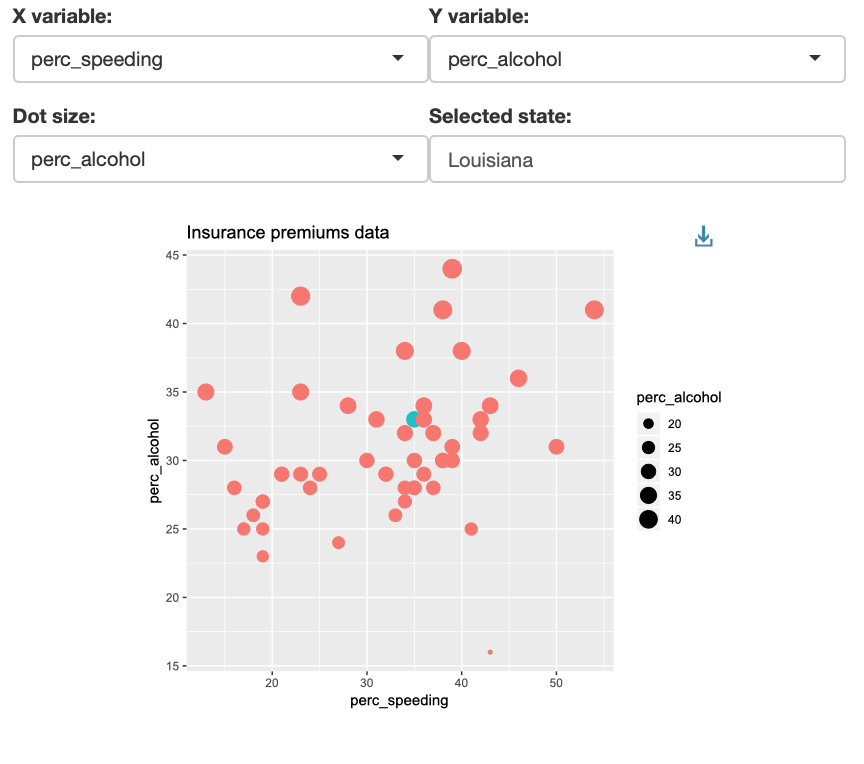

## Assignment 6

Start from the chart we created in `lectures\lesson18_interactiveggplot` then add:

1. A drop-down menu to select a variable to map to `size`
2. A text-box to type a state to highlight using `color`. Check this [link](https://shiny.rstudio.com/tutorial/written-tutorial/lesson3/) for a complete list of control widget

This is a pic of how the final output should look like:

