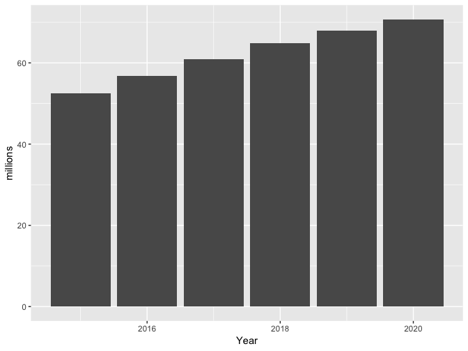
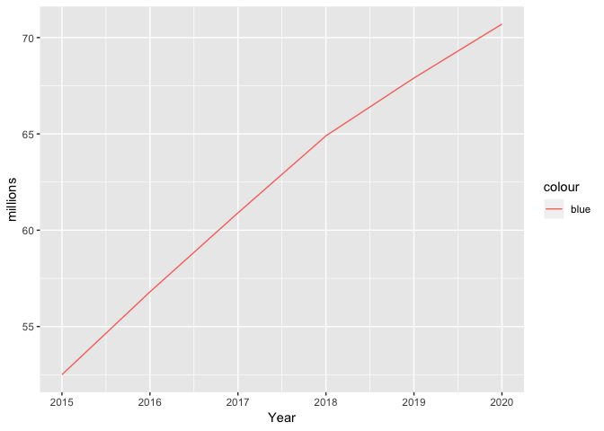
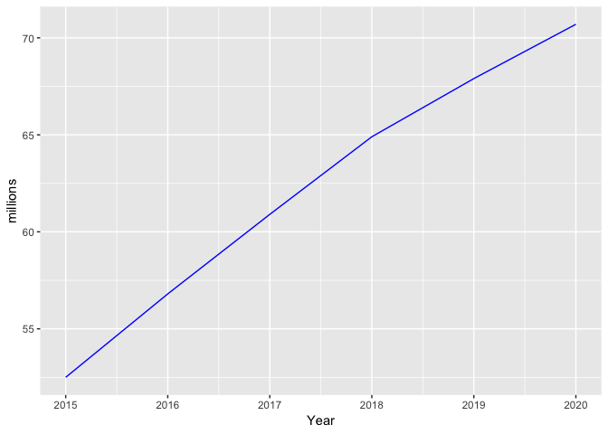

Data visualization
================

Data Visualization
==================

Base R offers comes with native plotting functions for data visualization, such as `plot()`, `barplot()`, `pie()`, etc. but we will not cover them. Instead, we focus on another graphic library called [ggplot2](http://ggplot2.org/), which is part of the tidyverse package suite. Despite plotting functions in base R came chronologically before ggplot2 (and are still widely used), [ggplot2](http://ggplot2.org/) ([cheatsheet](https://www.rstudio.com/wp-content/uploads/2015/03/ggplot2-cheatsheet.pdf)) is probably the most popular package for dataviz. Its rapid success is due both to the attractive design of its plots and to a more consistent syntax. Also, there are a number of [extensions](http://www.ggplot2-exts.org/) developed within the ggplot2 framework that make easier to add themes or create more sophisticated charts.

ggplot2
=======

References
----------

Check [Chapter 3](http://r4ds.had.co.nz/data-visualisation.html) on dataviz in ggplot2.

Installing ggplot2
------------------

Because you already installed the tidyverse, to use `ggplot2` you can just call `library(tidyverse)`. From now we will be using functions that are not part of base R, thus make you rerun `library(tidyverse)` every time you start a new R session, and to have a `library(tidyverse)` call before you use any ggplot2 function in your RMarkdown. If you get error messages saying that R `could not find function`, you probably have not loaded the package correctly.

``` r
library(tidyverse)
load(here::here('data', 'dataset.RData'))
```

Using ggplot2
-------------

Each ggplot2 statement requires at least a dataset, a set of aesthetics that the variables are mapped to, and the geometrical shape to visualize the aesthetics into.

For instance, to plot a chart of million of twitter users per year:

``` r
ggplot() +
  geom_col(data =  twitter_users, aes(x = Year, y = millions))
```


<p class="caption">
Millions of Twitter users
</p>

ggplot2 builds on an underlying grammar, which entails seven fundamental elements:

| Element     | Visual attribute                      |
|-------------|---------------------------------------|
| data        | dataset with the variables of interst |
| aesthetics  | x-axis, y-axis, color, fill, alpha    |
| geometries  | bars, dots, lines                     |
| facets      | coloumns, rows                        |
| statistics  | bins, smooth, count                   |
| coordinates | polar, cartesian                      |
| themes      | non-data ink                          |

The [concept of *mapping*](http://r4ds.had.co.nz/data-visualisation.html#aesthetic-mappings) is fundamental when learning ggplot2; although it might not be very intuitive at first, it ensures a high level of consistency when working in complex multivariate enviroment. *To map* means to assign a variable to an *aesthetic*, namely to a visual property such' height, fill color, border color, etc. In the previous example we mapped only to x-y coordinates; but you can call `?geom_col()` and scroll down in the help pane to the paragraph *Aesthetics* for a complete list of the attributes available. For instance, try to map Year to the fill too:

``` r
ggplot() +
  geom_col(data =  twitter_users, aes(x = Year, y = millions, ------ ))
```

From `freqCasualties`, plot a barchart of the count of casualties by class and gender (each bar refers to a class)

``` r
#what do we want to map to x and y? how do we map the third variable?
```

Some times, you want to manually **set** a value for a certain aesthetic, rather than **mapping** a variable to in - in which the aesthetic is really interpretable, since is a non-data ink element. For instance, note the difference between the charts below:

``` r
ggplot() +
  geom_line(data =  twitter_users, aes(x = Year, y = millions, color ='blue' )) 
```



``` r
ggplot() +
geom_line(data =  twitter_users, aes(x = Year, y = millions), color ='blue') 
```



To change color, you can use either [color names](http://www.stat.columbia.edu/~tzheng/files/Rcolor.pdf) (e.g., 'red'), hex codes (e.g., `#ff0000`) or rgb (e.g. `rgb(255, 0, 0)`).

So far, we specified aesthetics and datasets inside a specific geom, but if we only use one dataset we can pass it to the `ggplot()` function and let the `geom_` to inherit the `aes` from the `ggplot()` statement.

``` r
#Use the dataset twitter_users
#Use the set of aesthetics: aes(x = Year, y = millions )
#combine together geom_line() and geom_point() 
```

``` r
#use twitter_users to plot a linechart of twitter users over time
#use sn_users to overlay a linechart of FB users over time
```

### Exercise:

-   use `beerDt` to create a linechart of beer consumption (in gallons of ethanol) in US from 1903.
-   add a layer of points using `geom_point`

Flag the observation for beer consumption in your birthyear (for instance changing the point color). One approach is to create a dummy variable called 'myBirthYear' that takes value 'My birthyear' for your birth year, and NA for everything else. You could use `ifelse()` or conditional indexing/assignment. Use `ggtitle()` to add a title to the chart.
