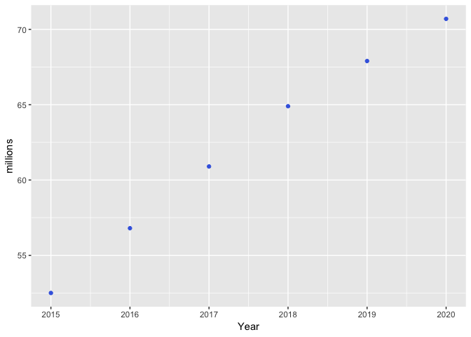
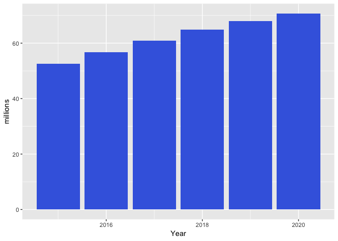
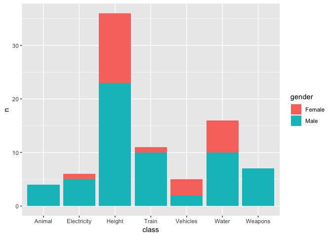

lesson 5: Data Visualization
================

Statistical transformation
==========================

So far, we have only used geoms that by default use an `identity` transformation, thus mapping values *as is*. In fact, we could rewrite the charts from the last time as a function of their statistical transformation:

``` r
ggplot() +
  stat_identity(aes(x = Year, y = millions), color = '#4169E1', data =  twitter_users, geom = 'point')
```



``` r
ggplot() +
  stat_identity(aes(x = Year, y = millions), fill = '#4169E1', data =  twitter_users, geom = 'col')
```



However, sometimes you need to transform values before plotting. For instance, check the difference between `freqCasualties` (the one we used with `geom_col`) and `selfiesCasualties`. How are the two datasets different? What do you map to `y` for each of them?

``` r
#This it the output we are looking for:
ggplot(data = freqCasualties, aes(x = class, y = n, fill = gender)) + 
  geom_col()
```



``` r
#we want to plot the below chart using selfiesCasualties
#1. Replicate the above using selfiesCasualties and geom_bar() instead of geom_col. You need to change the default stat  to 'identity'

#ggplot( data = selfiesCasualties, aes()) +
#  geom_bar()

#2. Plot proportions instead of counts for both the previous charts
```

To plot a barchart for `selfiesCasualties`, you need to map y to the frequencies count of each `class` and `gender`. For dataset where **each row is an observation** (versus the count for each grouping level) you can use `geom_*(stat = 'count')`, which is the default for `geom_bar()`. To concude, you can view `geom_col` as a special instance of `geom_bar(... , stat='identity')`

Exercise
--------

In this exercise we are working with a dataset of LSU graduates in May 2017.

``` r
#Load the csv from your local or github. If you use github you need the link to the "raw" file
dt <- read_csv('https://raw.githubusercontent.com/DarioBoh/ISDS3105_fall18/master/data/graduates_2017may.csv')
```

    ## Parsed with column specification:
    ## cols(
    ##   Sex = col_character(),
    ##   Ethnicity = col_character(),
    ##   College = col_character(),
    ##   Curriculum = col_character()
    ## )

``` r
#1. Inspect it using glimpse()
#2. Use the plot a barchart of the counts of graduates by college. Map the bar fill to gender.
```

Read the documentation for `?geom_bar` to see how you can map `y = ..propr..` instead of `y = ..count..` to plot the proportions of the students in each college.

``` r
#' 3.
#' ggplot(data  = ..., aes(... , ...)) +
#' geom_bar()
```

Add to the code for question 3 `group = Sex` and `position  = 'dodge'` to plot the distribution of genders across schools:

``` r
#' switch between position = 'dodge' and position = 'fill' 
#' to make sure your interpretation of the data is consistent
```

Now try to use `may2017graduates`, to map the fill to gender and the number of graduates to the y. Use `..prop..` to transform the number to a proportion. Also, use `position = 'dodge'` to plot m/f proportions bars next to each other.

Faceting
========

Mapping too many variables on the same geom can make your chart hard to comprehend. When you have a categorical variable that you want to control for, facets allow to create a grid of charts of your dataset, where each chart is a level of the variable that you are faceting for. For instance, let's say we want to analyse gender bias controlling for race in each college. Use

``` r
#ggplot() +
#  geom_bar() +       #plot a count of students in each college
#  facet_wrap(~ Ethnicity)
```

``` r
#repeat the previous but facetting by College and mapping ethnicity to x
# add: labs(title = "New plot title", subtitle = "A subtitle", caption = 'data from www.lsu.edu')
```

Changing scales
===============

You can change the defaults of certain attributes using `scale_attrName_*` functions (e.g., colors). First, note that ggplot has two attributes that we could intuitively call "color", but are in fact two different visual properties of a geom: `color` and `fill`. Some geoms such as `geom_bar` have both, while others such a `geom_line` have only `color`. Now, suppose we want to change the `fill` color in a barchart. Thus we want to change `scale_fill_*`, and because we are setting the new values manually, we select `scale_fill_manual` from the `scale_fill_*` family. To select colors, you can sue rgb, hex or \[color names\]((<http://www.stat.columbia.edu/~tzheng/files/Rcolor.pdf>)

``` r
#ggplot(data = dt) +
#  geom_bar(aes(College, fill = Sex)) +
#  scale_fill_manual(values  = replace this with a vector of colors)
#  OR (ALTERNATIVELY) change the colors usig :     scale_fill_brewer(type = ..., palette = ...)
# use theme(panel.background = element_blank()) to remove the background color
# check the documentation for element_text() and use it within theme(axis.text.x = element_text()) to rotate the lables by 45 degrees
```

You might have noticed that ggplot2 uses default names for the scales of the mapped variables. You can change those defaults by changing the values in `scale_[aes]_[type]`:

``` r
#ggplot(data = dt) +
#  geom_bar(aes(College, fill = Sex)) 
#use the below functions to change the x label in 'College Abbreviation'
#  scale_x_discrete(name = 'College Abbreviations') 
#use the below function to change the legend title into "gender" the legend values into 'Male' and 'Female'
#  scale_fill_discrete(name = ... , labels =  ... ) 
#move the legend to the bottom. To find out how to do that, check the documentation for theme(legend.position)
```
