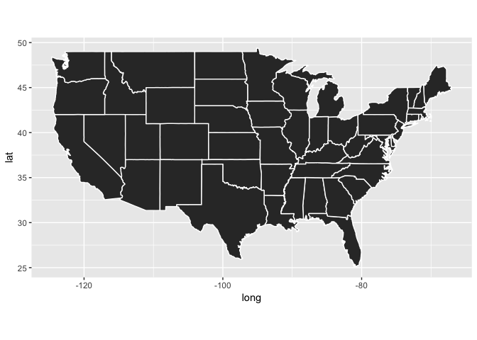
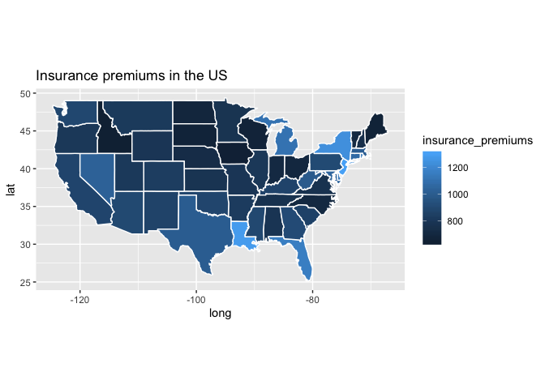
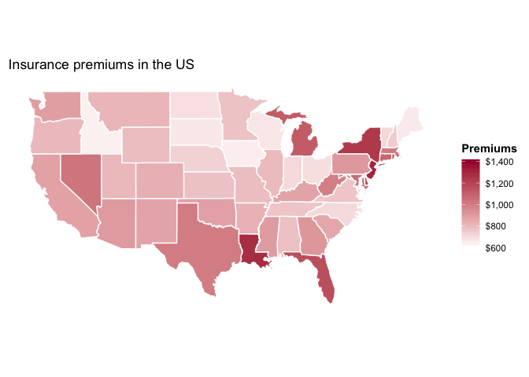
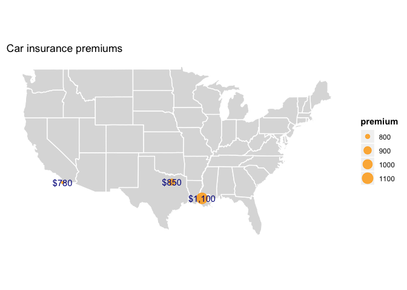
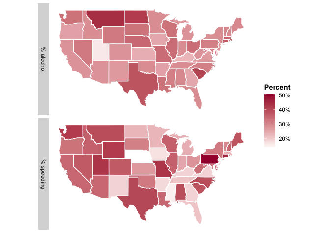

Lesson 12
================

Geospatial Visualization
========================

In ggplot2 you can leverage the flexibility of `geom_polygon` to plot maps using geographical coordinates. The shape of each geographical entity is treated as a polygon, and its boundaries defined in longitudinal/latitudinal coordinates. To plot a map, you need a dataset describing the edges of the geographical areas you want to plot - geographic regions in ggplot are nothing but polygons. The package `maps` contains some datasets of the most used geographical areas, and you can use the function `map_data` to retrieve maps using a country or region names.

``` r
library(tidyverse)
library(fivethirtyeight)
```

Choropleth map
--------------

To plot a choropleth map in ggplot, we need to define each region as a polygon. You can use the function `ggplot2::map_data` to a dataset of polygons coordinates for the most popular geographical areas. For instance for a map of the US by state:

``` r
states <- map_data("state")
ggplot(data = states) + 
  geom_polygon(aes(x = long, y = lat, group = group), color = "white") + 
  coord_fixed(1.3) +
  guides(fill=F) 
```



Now we can map to the aesthetics in `geom_polygon` a variable of interest. For instance, suppose we want to plot a map of the insurance premiums for assignment 3 using the `fivethirtyeight::bad_drivers` dataset. Let's focus on the two variables of interest: state and insurance premium in that state:

``` r
premiums <- select(bad_drivers, state, insurance_premiums)
top_n(premiums, 5)
```

    ## # A tibble: 5 x 2
    ##   state                insurance_premiums
    ##   <chr>                             <dbl>
    ## 1 District of Columbia              1274.
    ## 2 Florida                           1160.
    ## 3 Louisiana                         1282.
    ## 4 New Jersey                        1302.
    ## 5 New York                          1234.

The next step is to merge `insurance_premiums` into the `bad_drivers` dataset. That allows mapping `insurance_premiums` to any aesthetics of the `geom_polygong`.

``` r
mutate(premiums, state = tolower(state)) %>% 
  right_join(states, by = c('state' = 'region')) %>% 
                      ggplot() +
                      geom_polygon(aes(x = long, y = lat, group = group, fill = insurance_premiums), color = "white") + 
                      coord_fixed(1.3) +
                      labs(title = 'Insurance premiums in the US') -> mapInsurance 
mapInsurance 
```



Not bad but there is still a long way to go. For instance, it is hard to see from the legend what type of variable we are plotting. First, we overwrite the default for the labels of the color gradient legend. We want four values, including the highest and the lowest.

``` r
library(scales)
bks <- cbreaks(c(min(bad_drivers$insurance_premiums), max(bad_drivers$insurance_premiums)), pretty_breaks(4))
```

``` r
mapInsurance +
 scale_fill_gradient(limits = c(min(bks$breaks), max(bks$breaks)), breaks = bks$breaks, labels = dollar_format(), low = 'white', high = '#a50e39', name = 'Premiums') +
  theme(panel.background = element_blank(), 
        axis.title = element_blank(), 
        axis.text = element_blank(), 
        axis.ticks = element_blank(),
        legend.title = element_text(face = 'bold'))
```



If we had to plot values by cities, we need punctual observations instead. To get the coordinates from city names, we can use the dataset zipcode form the package `zipcode`

``` r
library(zipcode)
data("zipcode") #load the dataset
```

For instance, to find the coordinates for Baton Rouge, we could query by zipcode or just keep a random value for the lat-long pairs associated to Baton Rouge since their variation is trivial when plotting a national map. Suppose we had to plot the premiums of the following cities:

``` r
citypremium <- tibble(city = c('Dallas', 'Baton Rouge', 'San Diego'),
                      state = c('TX', 'LA', 'CA'),
                      premium = c(850, 1100, 780))
citypremium
```

    ## # A tibble: 3 x 3
    ##   city        state premium
    ##   <chr>       <chr>   <dbl>
    ## 1 Dallas      TX        850
    ## 2 Baton Rouge LA       1100
    ## 3 San Diego   CA        780

Merge with geospatial information

``` r
citypremium <- citypremium %>% left_join(zipcode, by = c('city', 'state')) %>% distinct(city, .keep_all = T) 
citypremium
```

    ## # A tibble: 3 x 6
    ##   city        state premium zip   latitude longitude
    ##   <chr>       <chr>   <dbl> <chr>    <dbl>     <dbl>
    ## 1 Dallas      TX        850 75201     32.8     -96.8
    ## 2 Baton Rouge LA       1100 70801     30.4     -91.2
    ## 3 San Diego   CA        780 92101     32.7    -117.

``` r
 ggplot(states) +
  geom_polygon(aes(x = long, y = lat, group = group), color = "white", alpha = .2) + 
  geom_point(data = citypremium, aes(x = longitude, y = latitude, size = premium), color = 'orange', alpha = .8) +
  geom_text(data = citypremium, aes(x = longitude, y = latitude, label = scales::dollar(premium)), color = 'darkblue', show.legend = F) +
  coord_fixed(1.3) +
  labs(title = 'Insurance premiums in the US')  +
    theme(strip.text.y = element_text(angle=90),        
          panel.background = element_blank(), 
          axis.title = element_blank(), 
          axis.text = element_blank(), 
          axis.ticks = element_blank(),
          legend.title = element_text(face = 'bold')) +
  ggtitle('Car insurance premiums')
```



And of course, we can use facetting too. For instance for plotting both `perc_speeding` and `perc_speeding`

``` r
select(bad_drivers, state, perc_speeding, perc_alcohol) %>% 
  mutate(state = tolower(state)) %>% 
  right_join(states, by = c('state'='region')) %>% 
  gather(hazardType, perc, perc_speeding, perc_alcohol) %>% 
  mutate(hazardType = case_when(hazardType == 'perc_speeding' ~ "% speeding",
                                T ~ "% alcohol"),
         perc = perc/100) -> dt 
  ggplot(dt) +
  geom_polygon(aes(x = long, y = lat, group = group, fill = perc), color = "white") +
  coord_fixed(1.3) +
  scale_fill_gradient(labels = percent_format(), low = 'white', high = '#a50e39', name = 'Percent') +
  facet_wrap(~ hazardType, ncol = 1,  strip.position = 'left') +
  theme(strip.text.y = element_text(angle=90),         #you can save theme to an object to create a "style"
        panel.background = element_blank(), 
        axis.title = element_blank(), 
        axis.text = element_blank(), 
        axis.ticks = element_blank(),
        legend.title = element_text(face = 'bold'))
```



``` r
knitr::kable(distinct(dt, state, hazardType, perc) %>% spread(hazardType, perc))
```

| state                |  % alcohol|  % speeding|
|:---------------------|----------:|-----------:|
| alabama              |       0.30|        0.39|
| arizona              |       0.28|        0.35|
| arkansas             |       0.26|        0.18|
| california           |       0.28|        0.35|
| colorado             |       0.28|        0.37|
| connecticut          |       0.36|        0.46|
| delaware             |       0.30|        0.38|
| district of columbia |       0.27|        0.34|
| florida              |       0.29|        0.21|
| georgia              |       0.25|        0.19|
| idaho                |       0.29|        0.36|
| illinois             |       0.34|        0.36|
| indiana              |       0.29|        0.25|
| iowa                 |       0.25|        0.17|
| kansas               |       0.24|        0.27|
| kentucky             |       0.23|        0.19|
| louisiana            |       0.33|        0.35|
| maine                |       0.30|        0.38|
| maryland             |       0.32|        0.34|
| massachusetts        |       0.35|        0.23|
| michigan             |       0.28|        0.24|
| minnesota            |       0.29|        0.23|
| mississippi          |       0.31|        0.15|
| missouri             |       0.34|        0.43|
| montana              |       0.44|        0.39|
| nebraska             |       0.35|        0.13|
| nevada               |       0.32|        0.37|
| new hampshire        |       0.30|        0.35|
| new jersey           |       0.28|        0.16|
| new mexico           |       0.27|        0.19|
| new york             |       0.29|        0.32|
| north carolina       |       0.31|        0.39|
| north dakota         |       0.42|        0.23|
| ohio                 |       0.34|        0.28|
| oklahoma             |       0.29|        0.32|
| oregon               |       0.26|        0.33|
| pennsylvania         |       0.31|        0.50|
| rhode island         |       0.38|        0.34|
| south carolina       |       0.41|        0.38|
| south dakota         |       0.33|        0.31|
| tennessee            |       0.29|        0.21|
| texas                |       0.38|        0.40|
| utah                 |       0.16|        0.43|
| vermont              |       0.30|        0.30|
| virginia             |       0.27|        0.19|
| washington           |       0.33|        0.42|
| west virginia        |       0.28|        0.34|
| wisconsin            |       0.33|        0.36|
| wyoming              |       0.32|        0.42|

Exercise
--------

Use the `map_data("world")` and the dataset on [alcohol consumption in the world](https://github.com/fivethirtyeight/data/blob/master/alcohol-consumption)

``` r
dt <- read_csv('https://raw.githubusercontent.com/fivethirtyeight/data/master/alcohol-consumption/drinks.csv')
```

Work within your group to create four maps, one for each variable (`beer_servings`, `spirit_servings`, `wine_servings` and `total_litres_of_pure_alcohol`). To streamline the collaboration on Github I recommend following these steps:

1.  **One** member creates a subfolder called `exercises` in the main group repo. The repo should contain a .Rmd called "exercise1".

2.  Add the code for `exercise1` for downloading the dataset (that part is going to be the same for everyone). Push the repo.

3.  Everyone else pulls the repo. Now everyone should see on their machine a local copy of the `exercise` repo containing the .Rmd.

4.  Split the work between the members of your group. Once you are have finished, push your commit. For simplicity, avoid pushing simultaneously from multiple masters to the same origin. Solve the conflicts when needed.
