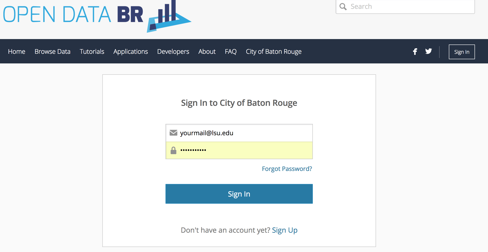
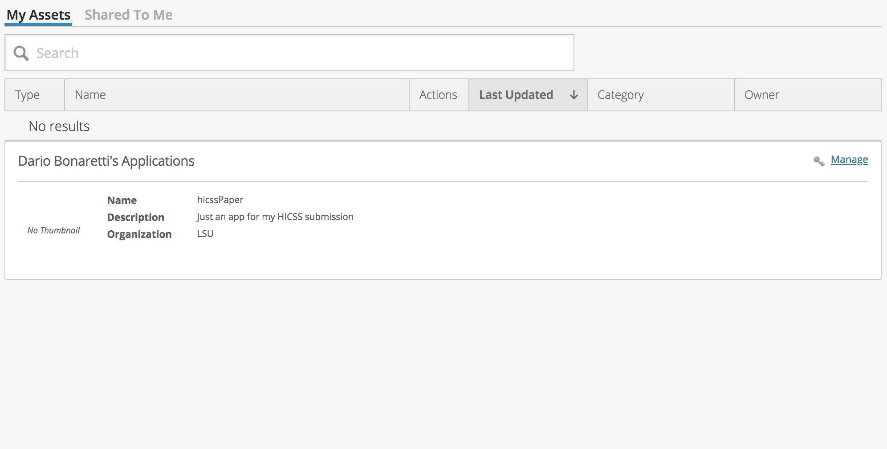

## API access to Open Data BR

#. [Sign-up](https://data.brla.gov/login) to Open Data BR




#. To access the [Socrata API](https://dev.socrata.com/) from R install `RSocrata`

#. Create a new app to obtain you authentication tokens: you need them to connect to the API from R. To create an app, from the tab "my assets" click on "manage" then "Create new application



#. Create the authentication token with the keys from the previous step and use `read.socrata` to call the API

```
token <- c(sec = 'yourSecretToken', app = 'youAppToken') #keep this private/on your local machine
read.socrata('https://data.ct.gov/resource/y6p2-px98.json?category=Fruit&item=Peaches', app_token = token[['app']])
```