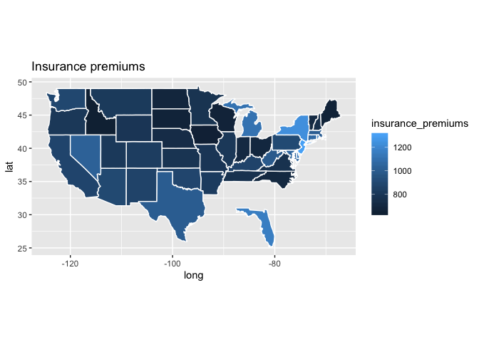
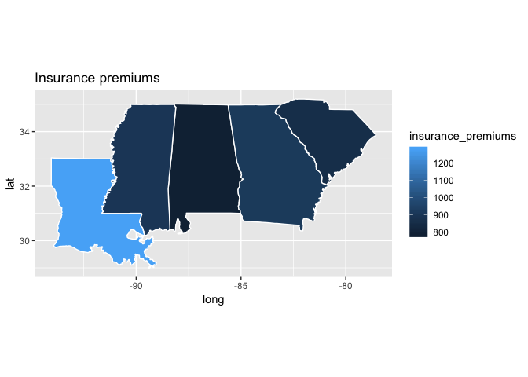

Iterations
================

``` r
library(tidyverse)
library(fivethirtyeight)
```

# Why do we need to iterate?

Suppose you want to calculate the mean value for each row of the below
tibble:

``` r
set.seed(1)
t <- tibble( x = list(
                sample(c(1:10), size = 10, replace = T),
                sample(c(1:10), size = 10, replace = T),
                sample(c(1:10), size = 10, replace = T)
            ))
t
## # A tibble: 3 x 1
##   x         
##   <list>    
## 1 <int [10]>
## 2 <int [10]>
## 3 <int [10]>
```

Using `mean()` on the column-list doesn work:

``` r
mean(t$x)
## Warning in mean.default(t$x): argument is not numeric or logical: returning
## NA
## [1] NA
```

Instead, you want to apply `mean()` to each element of `x`.

## Iteration using for-loops

One way of iterating is by using a for-loop. For loops have three
elements: output, sequence, body

``` r

x <- list(1, 'hi', TRUE, T) 

output <- vector("list", length(x))  # output
for (i in seq_along(x)) {            # sequence
  output[i] <- typeof(x[[i]])        # body
}

output
## [[1]]
## [1] "double"
## 
## [[2]]
## [1] "character"
## 
## [[3]]
## [1] "logical"
## 
## [[4]]
## [1] "logical"
```

1.  **Output**: The object that will contain our output. Because
    for-loops have a known number of iterations, we should always be
    able to predict how many values we will have in output and to
    allocate space accordingly.

2.  **sequence**: Indicates when to exit the for-loop. Each iteration
    will assign to `i` a different value from `seq_along(x)`.

3.  **body**: This is the code that instructs R on what to do at each
    iteration.

Build a for-loop to calcualte the mean for each element of `t`

``` r

output <-       # output

for (...) {     # sequence
  ...           # body
}
## Error: <text>:4:9: unexpected ')'
## 3: 
## 4: for (...)
##            ^
```

Note how “filling” `t` is more efficient than iteratively add elements
to `t` using indexing:

``` r
library(microbenchmark)
t <- tibble(x = rep(t$x, 100))
microbenchmark(
  #below is the code for the for-loop specifing the dimensions of `output`
  preparringOutput = {
   output <- vector("double", length(t$x))  
   #########################################
   ## copy here the code for the for-loop ##
   #########################################
  },
  #below is the same for-loop WITHOUT specifing the dimensions of `output`
  withoutPreparring =   { 
    output <- NULL
   #########################################
   ## copy here the code for the for-loop ##
   #########################################
  }
)
## Unit: nanoseconds
##               expr  min   lq    mean median     uq   max neval cld
##   preparringOutput 2312 2457 2855.92 2575.5 2726.5 22214   100   b
##  withoutPreparring  122  146  162.69  154.0  161.5   811   100  a
```

## Iterate using `purrr::map()`

We can imitate for-loop iterations using `purrr::map()` (check `?map`
for an overview of all the functions within the map family):

``` r
x <- list(1, 'hi', TRUE, T) 
map(.x = x, .f = typeof)
## [[1]]
## [1] "double"
## 
## [[2]]
## [1] "character"
## 
## [[3]]
## [1] "logical"
## 
## [[4]]
## [1] "logical"
```

The main advantage of using `map()` is to have a more concise syntax,
but note how iterations with map are also faster:

``` r
x <- rep(x, 50)
microbenchmark(
  withMap = { map(x, typeof) },
  withLoop = {
    output <- vector("list", length(x)) 
    for (i in seq_along(x)) { output[i] <- typeof(x[[i]]) }
  }
)
## Unit: microseconds
##      expr     min      lq     mean  median       uq      max neval cld
##   withMap 115.925 118.498 129.6195 120.668 124.6065  316.146   100  a 
##  withLoop 245.473 249.031 285.7292 252.582 255.9295 1053.728   100   b
```

To pass the arguments of the function `.f`, when have to options:

  - list them in `...` for instance `map(.x = x, .f = sum, na.rm = T)`
  - create a anonymous function for instance `map(.x = x, .f = ~ sum(.x,
    na.rm = T))`

<!-- end list -->

``` r
#load the environment load(here::here('data', 'dataset.rdata'))
# calculate the quarterly means of iphoneSales removing NAs
```

## Use map() to pluck elements

You can use `map()` to extract elements from an object

``` r
t <- tibble(nums = list(obs1 = c(a = 'first', b = 'second'), 
                        obs2 = c(a = 'first'), 
                        obs3 = c(a = 'first', b = 'second', c = 'third')))

t %>% mutate(nums = map(.x = nums, 2, .default = as.character(NA)))
## # A tibble: 3 x 1
##   nums     
##   <list>   
## 1 <chr [1]>
## 2 <chr [1]>
## 3 <chr [1]>
#' we can simplify the data structure to an atomic vector using 
#' the functions map_chr, map_int, map_dbl, map_lgl
t %>% mutate(nums = map_chr(.x = nums, 2, .default = as.character(NA)))
## # A tibble: 3 x 1
##   nums  
##   <chr> 
## 1 second
## 2 <NA>  
## 3 second

#using map() to pluck values like iterating the subset function `[`
t %>% mutate(nums = map_chr(.x = nums, `[`, 2))
## # A tibble: 3 x 1
##   nums  
##   <chr> 
## 1 second
## 2 <NA>  
## 3 second
```

You can extract also by element name:

``` r
t %>% mutate(nums = map_chr(.x = nums, 'b', .default = NA))
## # A tibble: 3 x 1
##   nums  
##   <chr> 
## 1 second
## 2 <NA>  
## 3 second
```

## Rethinking assignment 4: iterating ggplot() function calls

Assignment 4 asked to plot a map of insurance premiums for the South US
only. Below are two approaches to rethink at that problem in a more
scalable way, for instance assuming we wanted to plot multiple regions
on different maps. Since each map will show the same variables, we can
think about iterating the call to `ggplot()`:

``` r
states <- map_data("state") #load the shapefile of US states
## 
## Attaching package: 'maps'
## The following object is masked from 'package:purrr':
## 
##     map
# create a variable to split by US-region
bad_driversSouth <- bad_drivers %>%
                        mutate(isSouth = case_when(state %in% c('Louisiana', 'Alabama', 'Mississippi', 'Georgia', 'South Carolina') ~ 'South',
                                                   T ~ 'Other'),
                               state = tolower(state))


bad_driversSouth %>% 
  split(.$isSouth) %>% 
  purrr::map(~ right_join(.x, states, by = c('state' = 'region')) %>% 
                      filter(!is.na(insurance_premiums)) %>% 
                      ggplot() +
                      geom_polygon(aes(x = long, y = lat, group = group, fill = insurance_premiums), color = "white") + 
                      coord_fixed(1.3) +
                      labs(title = paste('Insurance premiums')))
## $Other
```

<!-- -->

    ## 
    ## $South

<!-- -->

Another approach is to leverage the tibble data structure to nest
variables by the splitting variable `isSouth`:

``` r
bad_driversNested <- bad_driversSouth %>% group_by(isSouth) %>% nest()

bad_driversNested <- bad_driversNested %>% 
 mutate(chart = purrr::map(.x = data, ~ right_join(.x, states, by = c('state' = 'region')) %>% 
                      filter(!is.na(insurance_premiums)) %>% 
                      ggplot() +
                      geom_polygon(aes(x = long, y = lat, group = group, fill = insurance_premiums), color = "white") + 
                      coord_fixed(1.3) +
                      labs(title = paste('Insurance premiums'))))
bad_driversNested$chart[1]
## [[1]]
```

<!-- -->

``` r
#' Use map to produce 3 charts: Southern State, Mountain states, Others. 
#' Follow one of the 2 approaches above or to come up with your own, but don't 
#' forget to iterate the call to ggplot() rather then typing it down multiple times
mountainStates <- c('Montana', 'Wyoming', 'Colorado', 'New Mexico', 'Idaho', 'Utah', 'Arizona', 'Nevada')
```
