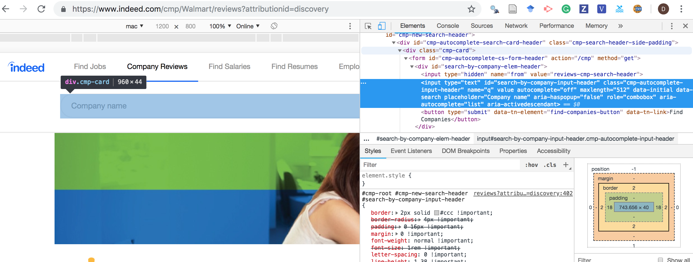
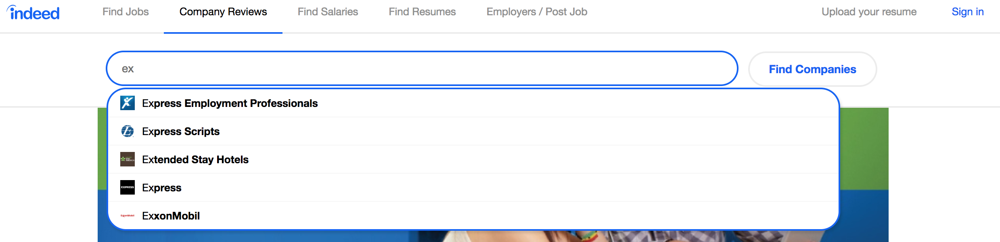
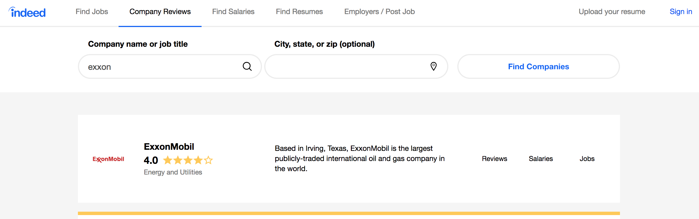

```{r setup, include=FALSE}
knitr::opts_chunk$set(echo = TRUE, eval = F)
```

# Introduction

Web scraping is the process of extracting information from a website. There are at least four main R packages that are popular for web scraping (sorted by easy of use):

[rvest](https://github.com/hadley/rvest)

[httr](https://github.com/r-lib/httr)

[splashr](https://github.com/hrbrmstr/splashr)

[RSelenium](https://github.com/ropensci/RSelenium)

We will work with `rvest` only, which has many limitations, but is easy to use and it works just fine with simple websites. In this example, we will build a scraper enterprise data from [Indeed](https://www.indeed.com/). The website looks like a search engine for career and salary information that you can retrieve querying the website through the search bar.

Although using a search bar requires simulating some interaction of the user with the website, in this website the searchbar is coded within a tag `<form></form>`. Filling out and submitting a form is something that you can manage in `rvest`. However, if you needed to manipulate some JavaScript, consider installing splashr (in requires to install Docker as well). For more complicated interaction, check RSelenium (originally inteded for testing webapps).

# The scraper

Writing code for a scraper requires referencing to the underlying HTML structure of a webpage. In Chrome, you can view the HTML code for any page by right-clicking and select "Inspect." That will open the developer console with the HTML code for the page. `rvest` allows you to scrape any information contained in the HTML code, which sometimes even exceeds what the website displayed (e.g., when there are metadata, like the id of a tweet).

Although you might not be familiar with HTML, writing a scraper does not necessarily require web-developing skills. HTML is a markup language (similarly to RMarkdown) the instructs a browser (e.g., Google Chrome) on how to render, or display, a web page. Scraping information is ultimately about finding the tag that embeds the information we are looking for. To reference tags you can use either CSS paths or XPath. To compose a CSS path use tag names and [CSS selectors](https://www.w3schools.com/cssref/css_selectors.asp). If you prefer using XPath, you install Chrome extensions such as [SelectorGadget](https://selectorgadget.com/).

Suppose we want to scrape data about the rating of some companies from [Indeed](https://www.indeed.com/). My approach is usually to see how close you can get to the output you need leveraging just patterns in the URL - hopefully close enough were assembling the right URL is enough to query all the data you need!

So navigate to the website and check to which URL you land we trying to collect company ratings manually. Probably you want to type the company names one by one in the search bar and search. Then, you want look at how many starts a company is awarded (company rating). Thus the scraper needs to automatize two tasks:

 1. search the company profile page on Indeed
 2. extract the information about "how many starts" the company has

## Searching company's profile page

Although the [webpage](https://www.indeed.com/Best-Places-to-Work) contains multiple elements and quite a lot of code, when inspecting the code would at least expect something like:

```
<!DOCTYPE html>
<html>
    <head>
    <title>15 Best Places to Work: Technology | Indeed.com</title>
    </head>
    <body>
        <p>Top-rated workplaces</p>
        <form>
          <input type = 'text'> 
        </form>
    </body>
</html>
```

These elements might be nested or might contain other tags, we definitely should have a `<body>` and that body is likely to contain a `<form></form>` if there are input buttons.

When we view the code for the input bar, the `<input>` element is not nested right after `<form>`, but is nested within a `<div>`


. 
 
So the first step is to establish a connection with the page:
 
```{r}
library(rvest)
library(tidyverse)
#' WARNING: we are using the link for Exxonmobil instead of the 
#' general  https://www.indeed.com/Best-Places-to-Work or https://www.indeed.com/cmp 
#' because the home page requires manipulating some JS
url <- 'https://www.indeed.com/cmp/Exxonmobil'
session <- html_session(url) 
```
 
Then we use `html_form` to access the code for any form within the page. There two forms (one at the top, one at the bottom). We save the first to to object `from`:
 
```{r}
form <- html_form(session)[[1]]
```

Now we need to fake a user who types a company name into the input bar and presses the submit button:

```{r}
form <- set_values(form, q = 'Exxon')
formSubmitted <- submit_form(session, form)
```

If you try to search for a company manually, you should realize that the searchbar tries to autocomplete based fuzzy-matching what you type with the company names that are actually available in Indeed. 




The first though may be "Ok now I need to fake a click on one of the results!" However, we said that simulating these behaviors is a bit more complicated, and we want to make use of static URLs as much as possible. Here is a workaround I found. Just pretend you do not care about the autocomplete and you brute-force the search engine to search for a name that is not matching any of those proposed (e.g., `Exxon` instead of `Exxonmobile`).


<figure>

<figcaption  style="color: grey;">If spongebob doesn't care, why would you?</figcaption>
</figure>


Most likely, from the results you have, you want to keep the first. As long as the first results *in general* work for you, you could integrate the missing URLs retrieving them manually.

After forcing the search for a string, you get a list of possible matches. 




If you click on any of the results, the server points you at a URL that looks like `https://www.indeed.com/cmp/companyName`. But where do we get the company name from? Inspecting the code for the link you might see that the tag `<a>` contains precisely that information.
However, the tag `<a>` is a common tag in HTML, and is used to mark a certain element as a link. We need to be more specific to unequivocally the link if are interested in. By looking at the relative position of `<a>` we realize that the element is nested into a `<div class = 'cmp-company-tile-blue-name'>`. Unlike `id`, in HTML classes do not necessarily uniquely identify an element. However, for this page (and for many others) the combination of tag+class is enough to reach the node that contains the `<a>` we need.
To specify a tag+class combination, we need to use [CSS selectors](https://www.w3schools.com/cssref/css_selectors.asp).

```{r}
read_html(formSubmitted) %>% 
           html_node('#cmp-root') %>% 
           html_node('div.cmp-SearchResultContainer') %>% 
           html_node('div.cmp-CompanyWidget-details') %>% 
           html_nodes('a.cmp-CompanyWidget-name') %>% html_attr('href') %>% 
           paste0('https://www.indeed.com', .) -> companyURL
companyURL           
```


**With `formSubmitted` we completed step 1!** Now we have a valid URL to navigate to the company profile on Indeed. 

Now `companyURL` contains the link to a single company page. You can explore the company page and view the elements available. In particular, we want to extract the rating and the company name. Extracting the company names is going to be useful to double-check we queried to correct page.

```{r}
companyPage <- html_session(companyURL) #read the page
companyPage %>% html_nodes('div.cmp-company-name') %>% html_text() 
companyPage %>% html_node('span.cmp-header-rating-average') %>% html_text()
```


## Exercise

```{r}
tempUrl <- 'https://www.usclimatedata.com/climate/baton-rouge/louisiana/united-states/usla0033' 
```

We want to collect temperature data for Baton Rouge from `tempUrl` for 2016-2017. The output is gonna be a tibble with: Day, High Temperature, Low Temperature, Precipitation, Snow, Snowdepth.


