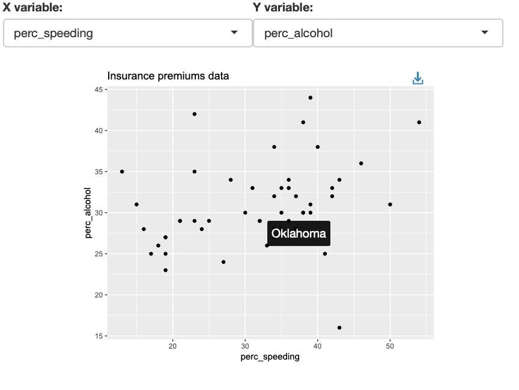

## Lesson 18

The goal is to create an interactive tool as in the picture below:

The tool has two features to implement:

1. Two drop-down menus for selecting the variables to map to the aesthetics x and y
2. An htmlwidget to show the state name of a point on a mouseover event

We do that in two steps:

1. Create an html file with 2 dropdown menus and a reactive pointchart (without any mouseover effect)
2. Add a mouseover effect 